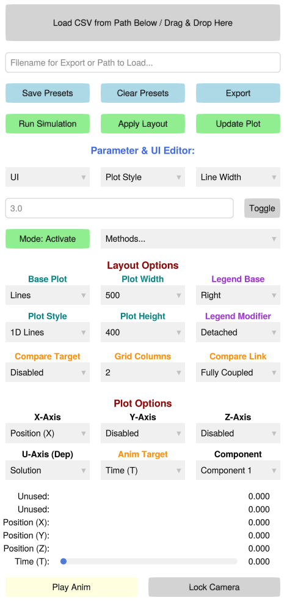

# PDEStudio Control Panel Overview

The `PDEStudio` graphical interface is driven by a unified, reactive control panel. Rather than hiding settings in nested pop-up windows, the interface is designed as a single, vertically scrolling dashboard. It is divided into four primary functional regions.

## 1. File Operations & Execution

The top region handles data serialization and backend execution. 
*   **I/O and Presets:** The text box acts as a dual-purpose path resolver. You can type a filename here to **Export** high-res figures/animations, or drop a previously saved `.csv` directly onto the top button to instantly recreate a past simulation state. You can also save or clear visual presets here.
*   **Reactive Triggers:** The green execution buttons (`Run Simulation`, `Apply Layout`, `Update Plot`) are tied to a background state machine. If you change a parameter that requires a backend recalculation or a structural layout change, the corresponding button will turn yellow to indicate that the UI is out of sync with the backend.

## 2. Advanced Editors

This section allows for deep, granular control over the simulation parameters and active physics.
*   **Parameter & UI Editor:** A hierarchical, three-tier dropdown system (Category → Scope → Parameter). It grants direct access to the backend dictionaries, allowing you to manually type and toggle specific line widths, solver tolerances, or UI labels without writing code.
*   **Method Controls:** Allows you to dynamically activate or deactivate specific numerical solvers or analytical baselines from your `SimulationConfig` on the fly. 

## 3. Rendering Configuration

The red-titled sections dictate how your numerical tensors are projected onto the screen.
*   **Layout Options:** Controls structural changes—like switching from 1D Lines to 3D Surfaces, adjusting legend placement, or setting up multi-column comparisons. *Note: Changes here require you to click "Apply Layout" to rebuild the Makie grid.*
*   **Plot Options:** Defines the active spatial axes (X, Y, Z) and the dependent mathematical field (U-Axis). Changes made here trigger instant, tear-free data updates without rebuilding the plot window.

## 4. Exploration & Playback

The bottom region is dedicated to interacting with the active data.
*   **Dimensional Sliders:** Dynamically generated sliders for every sweep parameter and physical dimension. These automatically scale to the global minimum and maximum of your active dataset, allowing you to smoothly slice through high-dimensional tensors.
*   **Camera & Animation:** Features a one-click animation player that sweeps across your chosen `Anim Target`. The **Lock Camera** button allows you to freeze the 3D azimuth and elevation, ensuring perfectly stable video exports.
